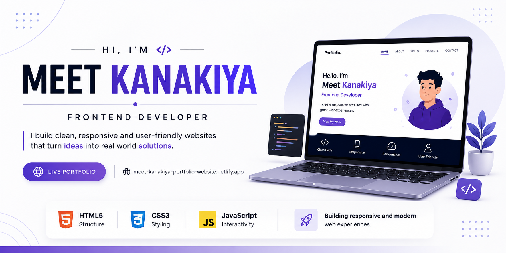

<p align="center">
  
</p>

<h1 align="center">🌐 Personal Portfolio Website</h1>

<p align="center">
A modern, responsive portfolio website built using HTML, CSS and JavaScript to showcase my skills, projects and journey as a Computer Engineering Student.
</p>

---

## 🚀 Live Demo

🌐 **Portfolio Website**

https://meet-kanakiya-portfolio-website.netlify.app/

---

## 🛠️ Tech Stack

### 🎨 Frontend

- HTML5
- CSS3
- JavaScript

### 🚀 Deployment

- Netlify

---

## ✨ Features

- 👋 Professional Hero Section
- 👨 About Me
- 💻 Skills Showcase
- 🚀 Featured Projects
- 📱 Fully Responsive Design
- 🎨 Clean & Modern UI
- 📩 Contact Section
- 🔗 Social Media Links
- ⚡ Smooth Navigation

---

## 📂 Project Structure

```text
Portfolio-Website
│
├── assets
├── images
├── index.html
└── README.md
```

---

## 📸 Preview

> Portfolio screenshots will be added soon.

---

## 📥 Installation

Clone the repository

```bash
git clone https://github.com/Meet-Kanakiya/Portfolio-Website.git
```

Open the project folder.

Run using VS Code Live Server

OR

Simply open **index.html** in your browser.

---

## 🎯 Purpose

This portfolio showcases:

- My Skills
- My Projects
- My Learning Journey
- Contact Information

It serves as my personal developer portfolio.

---

## 📬 Contact

📧 Email: kanakiyameet@gmail.com

💼 LinkedIn:
https://www.linkedin.com/in/meet-kanakiya-a5b951367/

💻 GitHub:
https://github.com/Meet-Kanakiya

---

## 👨‍💻 Developed By

**Meet Kankiya**

Computer Engineering Student

Passionate about Full Stack Development, Python and building real-world projects.

⭐ If you like this project, consider giving it a Star!
